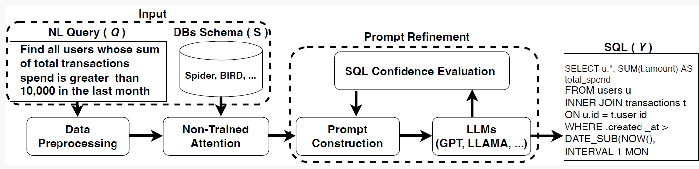

# Integrating Non-Parametric Attention and Prompt Refinement to Enhance LLM-BasedText-to-SQL Without External Knowledge
Generate, execute, and iteratively refine _valid_ SQLite queries from natural‑language questions using OpenAI chat models.

---

## At a Glance
| Problem | This project’s answer |
|---------|-----------------------|
| Large schema, irrelevant tables → hallucinated joins | **Entity‑aware *soft masking*** – numeric weights hint the model toward relevant tables/columns. |
| Unreliable SQL from LLM | **Execution + feedback loop** – run the query, analyse results, regenerate up to 3×. |
| Slow schema access | **On‑disk cache** (`./schema_cache/*.json`). |
| Need auditability | Full attempt history with validation feedback in `feedback_<mode>.json`. |

---

## Framework Overview




This framework improves LLM-based Text-to-SQL generation using **non-parametric attention** and **prompt refinement**, without external knowledge.

---

###  A. Data Preprocessing

- Extracts named entities and relations using **SpaCy** (`en_core_web_sm`).
- Identified entities are mapped to relevant schema elements.

---

###  B. Non-Parametric Attention

Assigns soft relevance weights to tables/columns based on entity matches:

| Type     | Matched Weight       | Unmatched Weight |
|----------|----------------------|------------------|
| Tables   | `1.0 + hits`         | `0.5`            |
| Columns  | `1.0 + hits`         | `0.3`            |

- Relation-aware scores update weights.
- Final weights are max-normalized.
- Weights appear in prompts via:
  - Inline SQL comments
  - Schema summary blocks

 **Soft mask, not hard filter**  
   The weights are **exposed inside the prompt** in two ways:

   *Inline comments* inside each `CREATE TABLE …`:

   ```sql
   CREATE TABLE orders (
       order_id INTEGER PRIMARY KEY,          -- Attention Weight: 1.5
       order_date TEXT                        -- Attention Weight: 1.5
   ) -- Attention Weight: 1.5
   ```

   *Standalone block*:

   ```
   ### Schema Attention Weights ###
   orders: 1.5
   orders.order_date: 1.5
   customers: 0.3
   ...
   ```

   > The LLM remains free to use any part of the schema, but higher‑weighted
   > elements are statistically more likely to be selected – a **soft mask**.
---

###  C. Prompt Refinement

- Prompts include:
  - NL query
  - Weighted schema
  - SQL generation instruction
- After SQL generation:
  - Query is executed and scored:
    - Success (0.5), row range reward/penalty, error penalty
  - If confidence score (`CS`) is low, regenerate with:
    - Feedback
    - Previous attempt summary


---

##  Feature Table
| Area | Details |
|------|---------|
| **Schema cache** | JSON snapshot of DDL + columns for each DB (`SchemaCache`). |
| **Few‑shot** | One‑shot demo (with or without external knowledge). |
| **Chain‑of‑Thought (optional)** | `--chain_of_thought True` injects a CoT instruction but strips CoT from final answer. |
| **Self‑validation loop** | Up to 3 cycles: execute → analyse → feedback → regenerate. |
| **Confidence scoring** | Combines execution success, row count, and issue count. |
| **Timeouts & retries** | `signal.alarm` for code/DB, `backoff` for rate‑limits. |

---

## Installation

```bash
python -m venv venv
source venv/bin/activate  # Windows: .env\Scriptsctivate
pip install -U openai backoff sqlparse tqdm spacy
python -m spacy download en_core_web_sm
```

> `signal.alarm` requires POSIX (Linux/macOS). On Windows use WSL or adapt to `multiprocessing`.

---

##  Data Layout

```
project/dev/
├── databases/
│   └── <db_id>/<db_id>.sqlite
└── eval/
    └── dev.json
```

`dev.json` object schema:

```json
{
  "question": "How many orders were shipped to Canada in 2024?",
  "db_id":    "northwind",
  "evidence": "Canada appears in the 'Customers' table under 'Country'."
}
```
Please download the BIRD dataset from- https://bird-bench.github.io/
---

## Usage

```bash
export OPENAI_API_KEY="sk-..."   # or pass via --api_key

python nl2sql_attention.py   --eval_path   eval/eval.json   --mode  dev   --db_root_path       databases   --api_key            $OPENAI_API_KEY   --engine    gpt-4o   --data_output_path   outputs/   --feedback_output_path outputs/feedback_dev.json   --use_knowledge      False   --chain_of_thought   False
```

Outputs:

```
outputs/
├── predict_dev.json   # {int: SQL string}
└── feedback_dev.json  # per‑question attempt log
```

---

## ⚠️  Limitations 

* `--use_knowledge` flag is parsed but not threaded into prompt builder since we focus on the text2sql case without usage of any external knowledge.
* For the evaluation, we use EX and VES defined by the original BIRD repository (https://github.com/AlibabaResearch/DAMO-ConvAI/tree/main/bird)

---

> Found a bug or have an improvement? PRs welcome!
